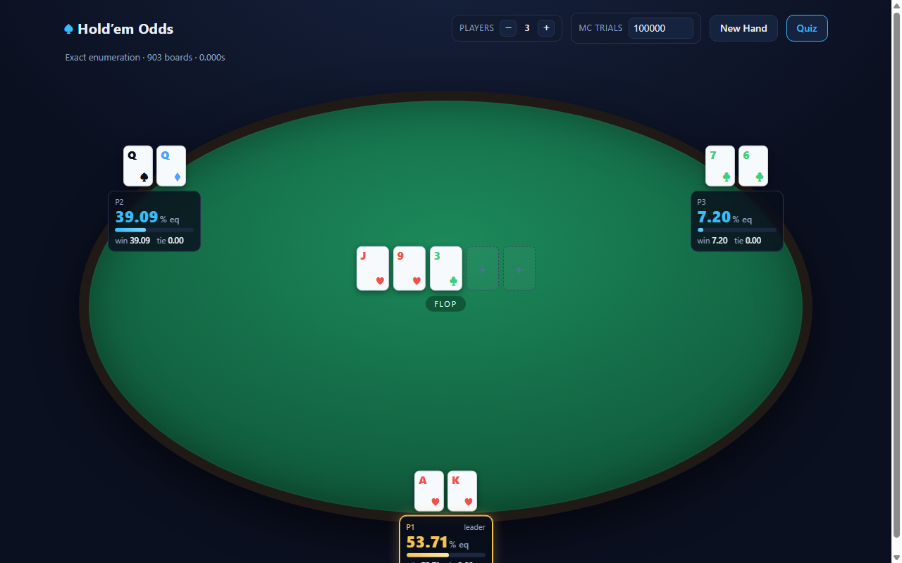

# Hold'em Odds

Texas Hold'em equity calculator with a local web UI. Computes exact and Monte Carlo equity for 2–9 players at any street.



## Features

- **Exact enumeration** over all possible board completions
- **Monte Carlo simulation** with configurable trial count and 95% confidence intervals
- Per-player win%, tie%, and equity with hand-category breakdowns on hover
- Interactive card picker with four-color deck
- **Quiz mode** — test your poker intuition:
  - *Who's Ahead?* — guess which player has the best equity
  - *Should You Call?* — decide call or fold given pot odds, then see if you were right

## Building

Requires a C++17 compiler and CMake 3.15+.

```
cmake -S . -B build
cmake --build build --config Release
```

## Running

```
./build/Release/poker_server.exe
```

Open http://127.0.0.1:8090 in your browser.

### CLI

```
./build/Release/poker.exe --players AhKh,7d2c --board Jh9h3c
```

### Options

| Flag | Description |
|------|-------------|
| `--port N` | Server port (default: 8090) |
| `--web DIR` | Path to web assets (default: `web`) |
| `--trials N` | Monte Carlo trial count (CLI) |
